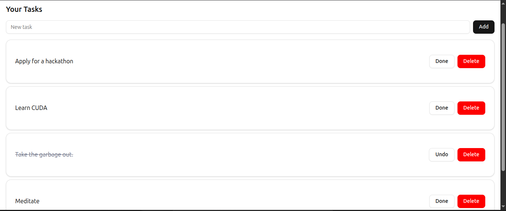

# Task Manager

A simple and modern task management app built with React, Vite, and Tailwind CSS.

## Features

- Add, complete, and delete tasks
- Persistent storage using local storage
- Responsive design
- Clean and minimal UI

## Getting Started

### Prerequisites

- [Node.js](https://nodejs.org/) (v18 or newer recommended)
- [pnpm](https://pnpm.io/) (or use npm/yarn)

### Installation

Clone the repository and install dependencies:

```sh
git clone https://github.com/Usernyagah/taskmanager.git
cd taskmanager
pnpm install
```

### Running Locally

Start the development server:

```sh
pnpm dev
```

Open [http://localhost:5173](http://localhost:5173) in your browser to view the app.

### Building for Production

```sh
pnpm build
```

Preview the production build:

```sh
pnpm preview
```

## Screenshots

### Home Page


### Tasks Page




## Live Demo

The app is deployed on Vercel:  
https://taskmanager-theta-ten.vercel.app/

---

© 2025 Task Manager. All rights reserved.
